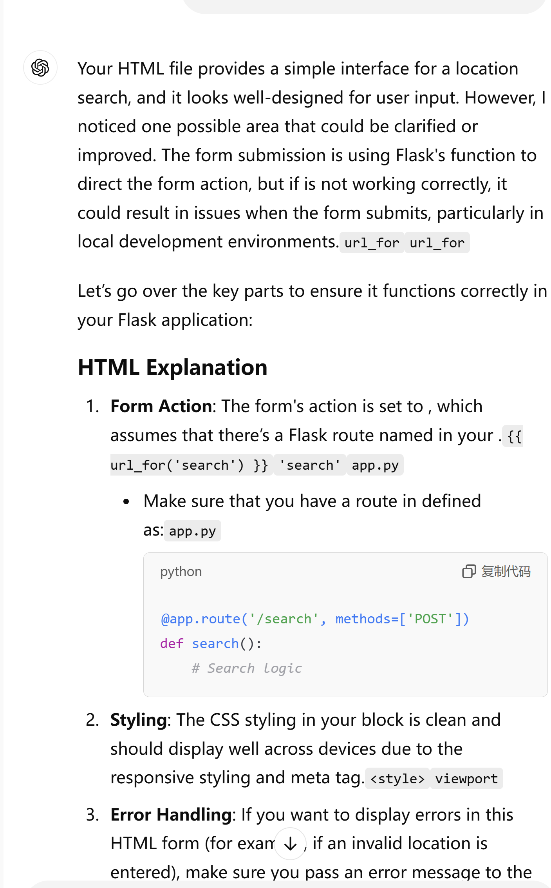
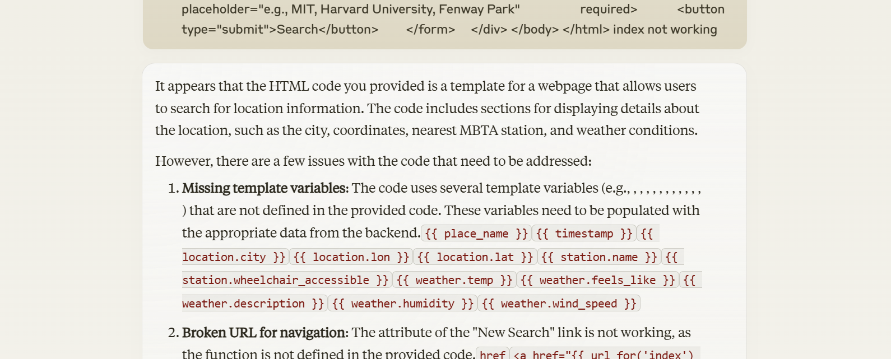

# MBTA-Web-App-Project

# Project Overview
The goal of my project was to create a web application that allows users to search for locations and retrieve information about the nearest MBTA station and the current weather conditions at that location. I used the Mapbox API to convert a user-supplied location name or address into latitude and longitude coordinates; the MBTA API to find the nearest MBTA station based on the user's location and retrieve information about its accessibility; and the OpenWeatherMap API to obtain the current weather conditions at the user's location, including temperature, humidity, and wind speed. Users can simply enter their region and get information about stations and weather near their location.

In addition to this basic information, I've also included how to handle errors and the current time, if any API request fails or the user enters an invalid location, the application will provide the user with a meaningful error message and the current time!

# Reflections
The development process for this project was not smooth. One of the biggest hurdles was how to properly integrate the various APIs and deal with the asynchronous nature of data collection. I spent a lot of time researching best practices on how to make API requests, parse responses, and propagate data within the application. Another challenge was ensuring the robustness and error handling of the application. At first, I would just display a generic error message if any API request failed. However, after some testing, I realized that this wasn't enough because it didn't provide the user with enough information to understand what went wrong. To address this, I used more specific error messages and provided clear instructions on how the user could troubleshoot the problem. Going forward, I will consider allocating more time for integration testing and end-to-end testing to ensure that the different components of the application work together seamlessly. I will also explore opportunities to further modularize the code base to make it easier to maintain and extend in the future.

This project was a valuable learning experience for me. AI tools such as ChatGPT improved my efficiency and understanding during the initial research and prototyping phase. The AI assistant helped us to quickly explore different API options, understand their functionality, and experiment with sample code. This allowed us to make more informed decisions and get a head start on the development process.

However, I also recognize that relying too heavily on AI tools has its drawbacks. For example, while ChatGPT provides useful code snippets, I have found myself struggling to understand the concepts of the code. Additionally, I've had issues with AI-generated code that didn't exactly match our project requirements, which required additional debugging and rework.

Going forward, I plan to continue using AI tools, but will take a more balanced approach. I will use them wisely for tasks such as research, brainstorming, and rapid prototyping, while ensuring that I maintain a deep understanding of the basics and take an active role in the development process.

